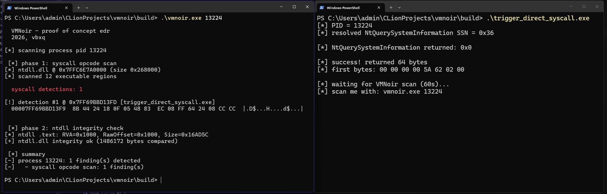

# VMNoir

<p align="center">
  
</p>

This is my small proof-of-concept EDR (Endpoint Detection and Response) tool for Windows x64  

## DISCLAIMER!

This project is just getting started and for now it's only a userland process scanner focused on syscall detection and memory integrity checks. But that said, it's meant to grow over time and.. I think it's a decent foundation to build on.
VMNoir is not a a proper EDR for now, because it would involves kernel drivers, continuous telemetry, active response, and all of that stuff. It's a learning/personal learning project, and just exists as a way to explore working from the defender's perspective.

VMNoir catches direct syscall for now. Indirect syscalls, call stack spoofing and other fancy stuff aren't handled yet, and the false positive filtering is heuristic-based, so it's not perfect.


## What it does right now

For now, VMNoir scans a running process to detect signs of direct syscall usage and ntdll.dll tampering  
It runs two detection stages against a target process:

### 1. Syscall opcode scan
Walks every executable memory region of the target process and looks for `syscall`/`sysenter` instruction opcodes. I made some  heuristics to filter out common false positives (like displacements in `jcc`/`call`/`jmp`, RIP relative operands, immediate values, and so on)

### 2. ntdll integrity check
Compares the `.text` section of the in-memory ntdll.dll against the on-disk copy byte by byte. If something doesn't match, it means the process (or something else) has patched ntdll, which is a classic unhooking technique. When a patch is found, it tries to resolve it back to a function name using the PE export table.

## Building

Requires a C17 compiler.

```
cmake -B build
cmake --build build
```

It produces two executables:
- `vmnoir.exe`, the thing itself
- `trigger_direct_syscall.exe`, a simple test program that performs a direct syscall and waits, so you can point VMNoir at it

It uses a small header-only C lib I made : [libsyscallresolver](https://github.com/vbxq/libsyscallresolver) !

## Usage

```
vmnoir.exe <PID>  # scan a process by PID
vmnoir.exe --self # scan VMNoir's own process
```

### Example with the included trigger

```
# terminal 1
trigger_direct_syscall.exe

# terminal 2
vmnoir.exe <PID from terminal 1>
```

## License

BSD-3-Clause license, 2026 - vbxq  
Read [License](LICENSE) for more details.
